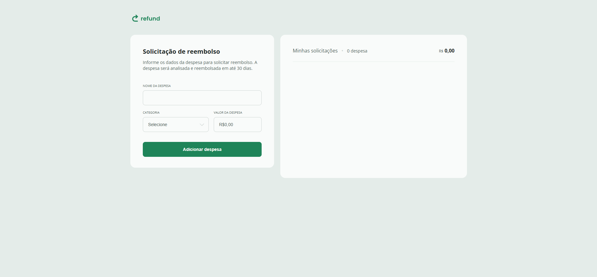

<h1 align="center"> Refund - Sistema de Reembolso 💰📝 </h1>

<p align="center">
  Uma aplicação web para gerenciamento de solicitações de reembolso, desenvolvida 100% com JavaScript puro.
</p>


<br>

<p align="center">
  
</p>

## 🚀 Tecnologias

Este projeto foi desenvolvido "do zero" para praticar os fundamentos do desenvolvimento web:

- **HTML5** (Estrutura semântica)
- **CSS3** (Estilização e Layout responsivo)
- **JavaScript (ES6+)** (Lógica, manipulação de DOM e Eventos)

## 💻 O Projeto

O **Refund** é um sistema de controle de despesas corporativas. O objetivo principal foi transformar um layout estático em uma aplicação dinâmica e funcional, onde o usuário pode adicionar novos itens à lista, visualizar o somatório total e remover despesas conforme necessário.

Diferente de projetos que utilizam frameworks (como React ou Vue), aqui **toda a lógica foi construída manualmente**, reforçando o entendimento de como o navegador funciona "por baixo dos panos".

## ✨ Funcionalidades

- **Adição de Despesas:** Formulário interativo para inserir nome da despesa, categoria e valor.
- **Formatação Monetária:** Uso da API `Intl.NumberFormat` para formatar valores em Real Brasileiro (BRL) automaticamente.
- **Cálculo Dinâmico:** O total de despesas e a quantidade de itens são atualizados em tempo real a cada adição ou remoção.
- **Remoção de Itens:** Botão para excluir despesas da lista com atualização imediata do resumo.
- **Validação de Campos:** Tratamento para garantir que números e textos sejam inseridos corretamente.

## 🧠 Aprendizados e Destaques

Durante o desenvolvimento deste projeto, foram aplicados conceitos importantes de JavaScript:

* **Manipulação do DOM:** Uso de `document.createElement`, `classList.add` e `append` para criar elementos HTML via script.
* **Event Listeners:** Captura de eventos de `submit` (formulário) e `click` (remoção).
* **Tratamento de Dados:** Conversão de strings para números (float) para cálculos matemáticos precisos.
* **Acessibilidade:** Foco nos estados de foco e feedback visual.

## 📂 Estrutura de Arquivos

```bash
refund-template-main/
├── assets/        # Ícones e imagens
├── index.html     # Estrutura da página
├── style.css      # Estilização global
├── script.js      # Lógica da aplicação (Engine)
└── README.md      # Documentação
```
Feito com 💻 por João Pedro 👋 Visite meu perfil!
